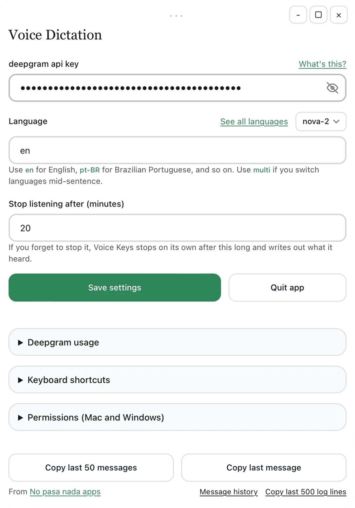

# Voice Keys

Voice Keys is a desktop dictation app for macOS, Windows, and Linux.

Press a keyboard shortcut to start recording, speak, then press it again. The transcript is pasted into your selected textbox or, if you don't have a textbox selected, copied to your clipboard to paste wherever you want.




## What you need

A free account with [Deepgram](https://deepgram.com), the service that turns
your speech into text. This is an industry standard in AI, it just doesn't have a consumer-facing app. Voice Keys is that bridge.

At the time of writing, new accounts get $200 in free credit — around 45,000
minutes of transcription (for scale, that's roughly six times through the
complete Harry Potter audiobooks, Stephen Fry narrating, end to end).

1. Create an account [here](https://deepgram.com)
2. Click API Keys -> Create New Key - > Advanced -> Change Role -> Admin (this role lets you see your usage) -> Create Key -> Copy your new key.
3. Download Voice Keys for your computer from the
   [latest release](https://github.com/panth-net/voice-keys/releases/latest).
4. Install it:
   - **macOS** — open the `.dmg` and drag Voice Keys into your Applications folder.
   - **Windows** — unpack the `.zip` and run `install.bat`. It installs the app and adds it to your Start Menu.
   - **Linux** — unpack the `.tar.gz` and run `./install-ubuntu.sh` to add it to your applications list.
5. Open Voice Keys, then paste your Deepgram key into the app and choose your language.
   - You can use a single language code like `en` or use `multi` for multilingual.
   - Nova-2 is their older model and is ~40-50% cheaper and is plenty good for transcription in English. For other languages, try Nova-2 first, but if it's not great, try Nova-3. For multilingual, you must use Nova-3.
6. Click Save.
7. If you haven't already done so, give Voice Keys permissions to use your microphone and keyboard shortcuts. Click *Permissions (Mac and Windows)* to see the instructions.
8. Set your *Keyboard shortcuts*. `cmd + period` is a good choice on macOS. `alt + period` is a good choice on Windows but use whatever is best for you.
9. Press your shortcut to start recording. During this time you can navigate your computer and do whatever you want. Press the same shortcut again to stop recording. The transcript is pasted into the textbox you have selected when the transcribing finishes or, if you don't have a textbox selected, is copied to your clipboard to paste wherever you want.
10. If for some reason it didn't paste, click the *Copy last message* button to copy the last transcript to your clipboard.

## Installing

### On a Mac, the first time you open it
#### Issue you will encounter
Mac will probably say something like *"Voice Keys can't be opened because
Apple cannot check it for malicious software."*

This is normal. It happens because we haven't paid Apple's yearly fee to have
the app officially stamped. Here's how to get past it:

#### How to solve it
**Right-click** the app (or hold Control and click it), choose **Open**, then
click **Open** again in the box that appears. You only have to do this once.

If this doesn't work, you can also go to **System Settings → Privacy & Security** and click **Open Anyway** next to the message about Voice Keys. Then click **Open** in the box that appears. You only have to do this once.

#### If you'd rather use the Terminal:

```bash
xattr -dr com.apple.quarantine "/Applications/Voice Keys.app"
```

### On a Windows PC, the first time you open it
Windows will probably say something like *"Windows protected your PC."*

This is normal. It happens because we haven't paid Microsoft's yearly fee to have the app officially stamped. Here's how to get past it:

#### How to solve it
Click **More info**, then click **Run anyway**. You only have to do this once.

## Giving it permission

### On a Mac

Your Mac needs your say-so before any app can listen to your microphone or
notice your keyboard shortcuts. Go to **System Settings → Privacy & Security**
and switch Voice Keys on in all three of these:

- **Microphone** — so it can hear you
- **Input Monitoring** — so it notices your two-key shortcut
- **Accessibility** — so it can type your words into other apps

Two things that trip people up:

- If you started Voice Keys from Terminal or from a code editor, that program
  needs the same three permissions. Your Mac gives permission to whatever
  launched the app, not just the app itself.
- After you change any permission, quit Voice Keys and open it again. Mac
  doesn't apply the change to an app that's already running.


### On Windows 11

Go to **Settings → Privacy & security → Microphone** and turn on both
**Microphone access** and **Let desktop apps access your microphone**. Then
quit Voice Keys and open it again.

Windows also hides new tray icons by default. To keep Voice Keys visible, go to
**Settings → Personalization → Taskbar → Other system tray icons** and switch
`voicekeys.exe` on.

### Building it yourself

You'll need [Rust](https://rustup.rs), version 1.82 or newer. 

To build it:

```bash
cargo build --release
```

The app is at
`target/release/voicekeys` (or `target\release\voicekeys.exe` on Windows).


### Adding it to your Ubuntu app menu

```bash
chmod +x ./install-ubuntu.sh
./install-ubuntu.sh
```

This puts Voice Keys in your applications list so you can launch it normally.

### A note for Linux users

Linux has two ways of running the desktop, called X11 and Wayland. Voice Keys
was built for X11. On Wayland it will start and run, but the keyboard shortcuts
may not work reliably. If you're not sure which one you have, you probably have
Wayland on a recent Ubuntu, and X11 on most older setups.


## Your message history

Every time Voice Keys writes out your words, it also saves them to a file, so
you always have a record of what you said. It looks like this:

```
[2026-07-30 14:22:07]
The quick brown fox jumps over the lazy dog.

[2026-07-30 14:24:51]
Second message, saved right after the first.
```

Click **Message history** at the bottom of the app to open it.

The file lives here:

| If you're on | Look in |
|---|---|
| Mac or Linux | `~/.config/voicekeys/transcripts.txt` |
| Windows | `%APPDATA%\VoiceKeys\transcripts.txt` |

**Please read this bit.** Everything you say is saved to that file and kept
forever. It's an ordinary text file with no password on it, so anyone who can
use your computer account can open it and read everything you've ever dictated.
If you back up your computer, or keep that folder in something like iCloud or
Dropbox, a copy of it goes there too.

Voice Keys never deletes anything from the file on its own. If you want it
gone, delete it yourself and the app will start a fresh one:

```bash
rm ~/.config/voicekeys/transcripts.txt
```

## Privacy

Short version: your voice goes to Deepgram and nowhere else, and Voice Keys
doesn't watch what you type.

The longer version:

- **Your recordings go to one place.** Voice Keys sends what you say to
  Deepgram so it can be turned into text. It doesn't talk to any other company,
  and there's no tracking, no usage statistics, and no "phoning home".
- **It isn't watching your typing.** Voice Keys does have to see your key
  presses — that's the only way to notice your shortcut — but it checks whether
  each one is your shortcut and immediately forgets everything else. Nothing you
  type is saved or sent anywhere.
- **Your words are saved on your own computer.** See
  [Your message history](#your-message-history) above. That file never leaves
  your machine unless you back it up or sync it somewhere.
- **Your Deepgram key is stored as plain text** in a settings file on your
  computer. It isn't scrambled or locked. See [SECURITY.md](SECURITY.md).

## Settings

You can change everything from the app's window. The settings are also kept in
a file called `config.yaml`, if you'd rather edit it directly:

```yaml
deepgram:
  api_key: ""
  model: "nova-3"
  language: "en"      # "en" for English, "multi" if you switch languages mid-sentence
  punctuate: true
  smart_format: true
  timeout_secs: 10.0

audio:
  sample_rate: 16000
  max_recording_minutes: 20

hotkeys:
  paste: ["alt", "dot"]
  clipboard: ["alt", "slash"]
```

Key names you can use for your shortcuts:

- **Holding keys:** `cmd`, `ctrl`, `alt`, `option`, `shift`
- **Letters:** `a` to `z`
- **Numbers:** `0` to `9`
- **Punctuation:** `minus`, `equal`, `tilde`, `leftbracket`, `rightbracket`,
  `semicolon`, `quote`, `backslash`, `comma`, `dot`, `slash`
- **Other:** `space`, `tab`, `enter`, `backspace`, `escape`, `capslock`, and
  `f1` through `f12`

The settings file lives here:

| If you're on | Look in |
|---|---|
| Mac or Linux | `~/.config/voicekeys/config.yaml` |
| Windows | `%APPDATA%\VoiceKeys\config.yaml` |

If you put a `config.yaml` right next to the app itself, Voice Keys uses that
one instead. That's handy for running it off a USB stick.

## Starting it automatically

**Mac** — System Settings → General → Login Items → click **+** → pick Voice
Keys.

**Windows** — press `Windows key + R`, type `shell:startup`, press Enter, then
put a shortcut to `voicekeys.exe` in the folder that opens. The included
`install.bat` can do this for you.

**Linux** —

```bash
mkdir -p ~/.config/systemd/user
cat > ~/.config/systemd/user/voicekeys.service << 'EOF'
[Unit]
Description=Voice Keys

[Service]
ExecStart=%h/.local/share/voicekeys/voicekeys
Restart=on-failure

[Install]
WantedBy=default.target
EOF

systemctl --user enable --now voicekeys
```

## When something's wrong

### The shortcut does nothing (Mac)

This is almost always permissions. Go back to
[Giving it permission](#on-a-mac) and check all three are switched on — and
remember to quit and reopen the app afterwards.

### Nothing gets typed out

- Check your Deepgram key is saved in the app.
- Open the app and click **Copy last 500 log lines**, then paste that
  somewhere to read it. It'll usually say what went wrong — a wrong key, or no
  internet.

### It's not hearing me

Look at the log (same button as above). Near the top it names the microphone
it picked. If that's the wrong one, change your computer's default microphone
and restart Voice Keys.

### Checking the keyboard shortcut (only if you need to)

Voice Keys doesn't record what you type. But if your shortcut isn't working and
you want to see what's happening, you can switch on a temporary diagnostic.

Open a Terminal, go to the folder with the app, and start it like this:

```bash
VOICEKEYS_DEBUG_KEYS=1 ./target/release/voicekeys
```

That records only the keys you've chosen as your shortcut, plus notes about
whether Voice Keys managed to start listening at all. For most problems that's
enough.

If that shows nothing at all, this version records the first 200 key presses
you make — **including keys that aren't your shortcut**:

```bash
VOICEKEYS_DEBUG_KEYS=2 ./target/release/voicekeys
```

Only use that second one if you're going to read the file yourself, and delete
it when you're done. Don't send it to anyone without reading it first.

Either way the file appears here:

| If you're on | Look in |
|---|---|
| Mac or Linux | `~/.config/voicekeys/debug_keys.log` |
| Windows | `%APPDATA%\VoiceKeys\debug_keys.log` |

```bash
rm ~/.config/voicekeys/debug_keys.log   # delete it when you're finished
```

Neither of these is ever on unless you turn it on by hand.

## Helping out

Found a bug or want to add something? See [CONTRIBUTING.md](CONTRIBUTING.md).

If you've found a security problem, please don't post it publicly — see
[SECURITY.md](SECURITY.md) for how to tell us privately.

## Licence

Voice Keys is free and open source under the [MIT licence](LICENSE), which
means you can use it, change it, and share it however you like.

---

From [No pasa nada apps](https://nopasanada.app/), by
[Pantheon Network](https://pantheonnetwork.co/).
